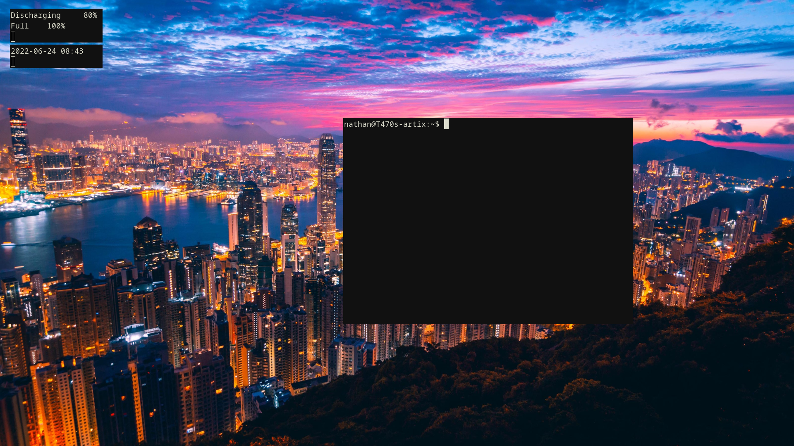

# Kiwmi config files

These are my personal config files for the [Kiwmi-compositor](https://github.com/buffet/kiwmi). For another config, checkout [this](https://github.com/dacyberduck/kiwmi-config).

## Installation

Place the files of this repository in `~/.config/kiwmi/`.

## Use

Run `kiwmi`, after you have installed the compositor.

### Caveat

Please note that I use a German keyboard. You may want to change that.
